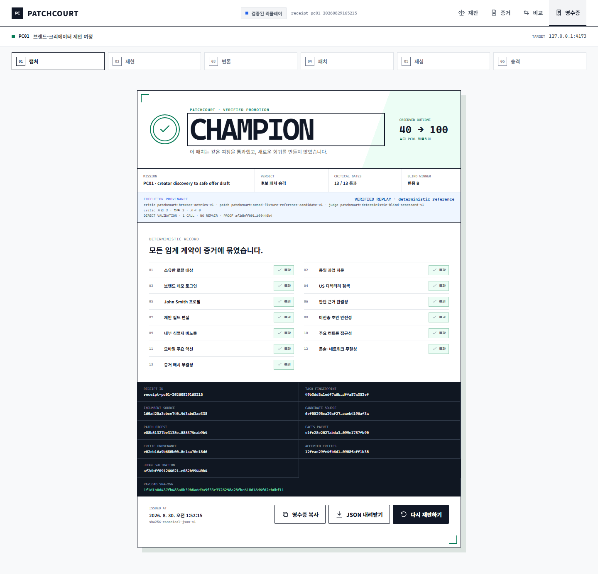

# PatchCourt

> AI가 고친 UI를 감으로 배포하지 않습니다. 같은 사용자가 같은 일을 했을 때 더 나은 결과가 나온 패치만, 실제 브라우저 증거로 승격합니다.

[▶ Public verified replay](https://wlsalswo14.github.io/PatchCourt-Championship/) · [60초 시연](docs/SUBMISSION_DRAFT.md#presenter-led-60-second-walkthrough) · [영수증 직접 검증](docs/evidence/latest/receipt.json)

[](https://wlsalswo14.github.io/PatchCourt-Championship/)

*검증된 PC01 공개 리플레이 — 동일 BU01을 desktop/mobile에서 재실행한 candidate가 13/13 critical gates를 통과했고, task·facts·source·critic·judge·payload 계보가 SHA-256 receipt에 봉인됐습니다. 40→100은 PC01 결정론적 benchmark 점수입니다.*

PatchCourt is an evidence-first release court for AI-built software. It freezes one realistic, falsifiable user job on an owned synthetic fixture, observes the incumbent in Chromium, compiles evidence-grounded findings, applies a bounded candidate patch, replays the exact journey, and promotes only after critical gates and a blinded comparison agree. The public link is a credential-free verified replay and makes zero AI-provider or PatchCourt API calls; live Gemini execution stays operator-side.

```text
frozen user task + owned target
  -> incumbent browser evidence
  -> grounded critic docket
  -> atomic implementation brief
  -> allowlisted candidate patch
  -> exact desktop/mobile replay
  -> 13 deterministic critical gates
  -> committed and blinded A/B judgment
  -> promotion | rejection | invalid receipt
```

## The breakthrough

Most AI coding systems log what changed. PatchCourt builds a **counterfactual user-outcome ledger**: it records what changed for the user when incumbent and candidate are forced through the same task.

That distinction changes the release unit. A persuasive diff, a model self-review, or a prettier screenshot is never enough. The release unit is a candidate whose outcome improved, whose protected behavior survived, and whose artifacts remain independently verifiable after the run.

## Championship journey

The PC01 / BU01 benchmark is deliberately narrow and falsifiable. A brand operator must:

1. sign in to the project-owned synthetic Brand Match fixture;
2. open Creator Directory, search `US`, and inspect `John Smith`;
3. determine audience, verified channel, market fit, and next action;
4. change the proposed fee to `$1,500`;
5. prepare a draft without sending it externally.

The journey is replayed at 1280x720 and 390x844. The seeded incumbent hides decision evidence, exposes an internal provider identifier, and breaks its mobile primary action. The candidate may change only the allowlisted value surface and may add factual claims only from a raw-byte-sealed synthetic fact packet.

## Why the verdict is hard to game

- **Evidence before opinion.** Every accepted finding cites a content-addressed browser artifact and an executable acceptance check.
- **Same task, symmetric capture.** Incumbent and candidate use the same task fingerprint, viewports, artifact shape, and collection rules.
- **Facts are sealed.** Every changed factual leaf must map to the verified-facts digest; an ungrounded leaf cannot enter an accepted candidate or promotion receipt.
- **Effects are blocked.** Browser collection rejects non-GET side effects, and the benchmark proves the offer remains an unsent draft.
- **Critical gates outrank taste.** Ownership, navigation, task completion, privacy, accessibility, responsive action, console/network health, and artifact integrity all run before judgment.
- **A/B identity stays hidden.** Neutral arm artifacts are committed before the semantic judge sees them; mapping and nonce are revealed only after the verdict.
- **Malformed judgment cannot become a verdict.** One bounded JSON repair is allowed; a valid first winner is locked, actual provider calls and rejected-response digest are sealed, and a second failure invalidates the run.
- **Failure is a first-class result.** A valid loss is `rejected`; missing or asymmetric evidence is `invalid`; neither can be silently converted into a win.
- **Receipts are tamper-evident.** Canonical SHA-256 payloads bind sources, evidence, facts, grounding, gates, blind order, critic provenance, execution providers, and decision lineage.

## Product surfaces

The React application has two honest operating modes:

- **Verified replay** is the public, credential-free experience. It reads a checked-in receipt only after recomputing its canonical hash and shows both promotion and short-circuited rejection paths.
- **Live court** connects to the local API, streams named lifecycle events, keeps recorded scores and arm images sealed while pending, and fetches the terminal receipt before showing any result.

Live execution is intentionally operator-side. The static public deployment never receives a Gemini key or private runtime data.

## Proof snapshot

| Proof | Outcome | Browser evidence | Critical gates | Blind judge | Independent check |
| --- | --- | ---: | ---: | ---: | ---: |
| Gemini 3.6 Flash live run `pc01-edaaca75-c913-4a20-8885-4b58e87163fe` | promoted | 44 + 1 grounding artifact | 13 / 13 | 1 call | all artifact bytes, ledger, provenance, payload SHA |
| Canonical recorded run `pc01-20260829165215` | promoted, PC01 40→100 and evidence 0/4→4/4 | 24 | 13 / 13 | 1 call | 122 / 122 verifier checks |
| Deliberate mobile regression `pc01-rejection-20260829165222` | rejected, incumbent retained | 24 | 12 / 13 | 0 calls | 120 / 120 verifier checks |

The rejection is not a decorative error screen: an offscreen mobile action fails `responsive_primary_action`, short-circuits judgment, and keeps the incumbent despite the candidate's otherwise higher score.

The production public build also scores 100/100/100/100 in desktop and mobile Lighthouse lab runs, with zero measured layout overflow and no console or failed-network errors in the browser contract. See the [performance evidence and measurement caveat](docs/evidence/performance/SUMMARY.md).

## System map

```text
apps/web                 React courtroom and verified replay
       | POST + named SSE + terminal receipt
apps/api                 target policy, run service, browser collector,
       |                 Gemini adapters, content-addressed artifact store
packages/core            contracts, state machine, compiler, promotion policy
       |
demo/brand-match         owned synthetic target + sealed verified facts
       |
benchmark + tests/e2e    frozen task, schemas, independent verifier, browser QA
       |
docs/evidence            authoritative promotion/rejection proof bundles
```

The runtime state machine is:

```text
created -> snapshotting -> observing_incumbent -> criticizing
        -> compiling_feedback -> patching_candidate
        -> observing_candidate -> deterministic_gates
        -> blind_comparison -> promoted | rejected | invalid
```

See [the architecture](docs/ARCHITECTURE.md), [security and rights boundary](docs/SECURITY_AND_RIGHTS.md), and [AI disclosure](docs/AI_DISCLOSURE.md) for the full contracts.

## Run locally

Requirements: Node.js 22+ and Playwright Chromium.

```powershell
npm ci
npm ci --prefix tests/e2e
npx playwright install chromium
```

Start a fresh owned fixture, the API, and the web app in separate terminals:

```powershell
$env:PATCHCOURT_DEMO_PORT = "4273"
npm run demo:start
```

```powershell
$env:PATCHCOURT_EXECUTION_MODE = "offline-demo"
$env:PATCHCOURT_OWNED_ORIGINS = "http://127.0.0.1:4273"
npm run dev:api
```

```powershell
$env:VITE_PATCHCOURT_TARGET_URL = "http://127.0.0.1:4273"
npm run dev:web
```

Open `http://127.0.0.1:4175`. Use a fresh alternate port when an unknown local server already owns the default; PatchCourt never reuses or terminates it implicitly.

For live Gemini execution, keep the secret in an owner-readable external env file and follow [the runbook](docs/RUNBOOK.md). Never place credentials in this repository or a browser environment.

## Verify independently

```powershell
npm run typecheck
npm test
npm run build
npm run test:e2e
npm --workspace @patchcourt/web run test:e2e
npm --workspace @patchcourt/web run test:e2e:live-states
node benchmark/verify-receipt.mjs docs/evidence/latest/receipt.json
node benchmark/verify-receipt.mjs docs/evidence/rejection/receipt.json
```

The default E2E suite writes only to ignored test artifacts and proves that both
authoritative evidence trees are byte-stable before and after the run. Use
`npm run evidence:update` only when intentionally curating a new canonical proof;
that guarded command is the sole supported writer for the checked-in receipts.
Likewise, default web E2E writes screenshots under ignored test results; only the
explicit `test:e2e:capture` variants replace the curated `design/final` gallery.

The suite covers contract/state-machine behavior, target policy, secret redaction, TOCTOU fact sealing, candidate grounding and repair, real Chromium collection, same-origin effect blocking, mobile offscreen-action detection, blind-order integrity, receipt tampering, promotion arithmetic, rejection short-circuiting, nested static hosting, and the real React workflow.

## AI use

- Gemini 3.6 Flash produced the visual system, implementation-ready design specification, responsive repair contract, and live evidence-grounded critique/patch/judgment calls.
- Deterministic metric critics supplement—not masquerade as—model critics; the receipt exposes each critic's proposed, accepted, and rejected counts alongside execution providers.
- Codex implemented the repository, integration, browser verification, evidence generation, and deployment workflow.

Model discretion never controls target ownership, task identity, artifact hashes, factual provenance, side-effect safety, critical gates, or receipt verification.

## Submission material

- [Competition fit and dates](docs/COMPETITION_FIT.md)
- [Submission draft and 60-second script](docs/SUBMISSION_DRAFT.md)
- [Promotion evidence](docs/evidence/latest/SUMMARY.md)
- [Rejection evidence](docs/evidence/rejection/SUMMARY.md)
- [Sanitized live Gemini evidence](docs/evidence/live/SUMMARY.md)
- [Performance evidence](docs/evidence/performance/SUMMARY.md)
- [Design fidelity ledger](design/fidelity-ledger.md)

PatchCourt uses only project-owned synthetic data and repository-created assets. No private production data is required.
